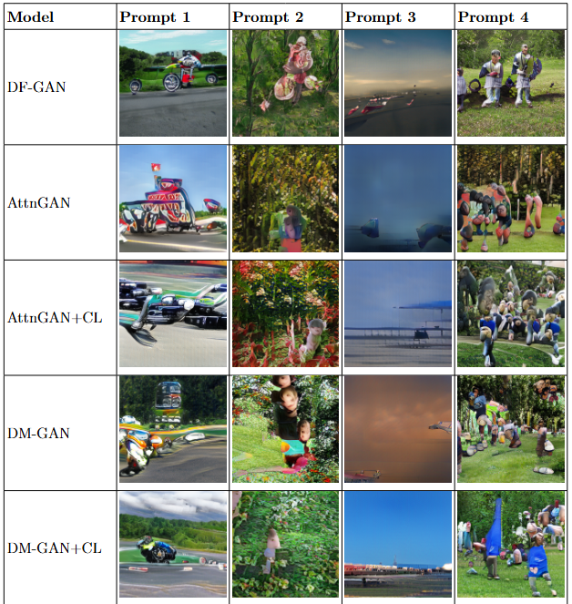

# 🧠 Text-to-Image GAN Benchmarking

A comparative study of five pretrained Text-to-Image (T2I) GAN models — **DF-GAN**, **AttnGAN**, **AttnGAN+CL**, **DM-GAN**, and **DM-GAN+CL** — evaluated on the **MS-COCO** dataset using both quantitative and qualitative criteria.

---

## ✍️  Sample Prompts

We evaluated all models with the following prompts:

- **Prompt 1**: A green car and a red motorcycle racing down the highway.  
- **Prompt 2**: A kid picking yellow flowers in the garden.  
- **Prompt 3**: A blue and red plane taking off from an airport at sunrise.  
- **Prompt 4**: A group of people playing football in a school garden.  

---

## 📊 Qualitative Results

Below is a visual comparison of the generated outputs for the given prompts:

  

> 📌 *Each image is 256×256 resolution. Models are evaluated on prompt-object alignment, color fidelity, and spatial coherence.*

---

## 🔗 Model Repositories

- [DF-GAN](https://github.com/tobran/DF-GAN)
- [AttnGAN](https://github.com/davidstap/AttnGAN)
- [DM-GAN](https://github.com/JuhongPark/DM-GAN)
- [AttnGAN+CL & DM-GAN+CL](https://github.com/huiyegit/T2I_CL)
